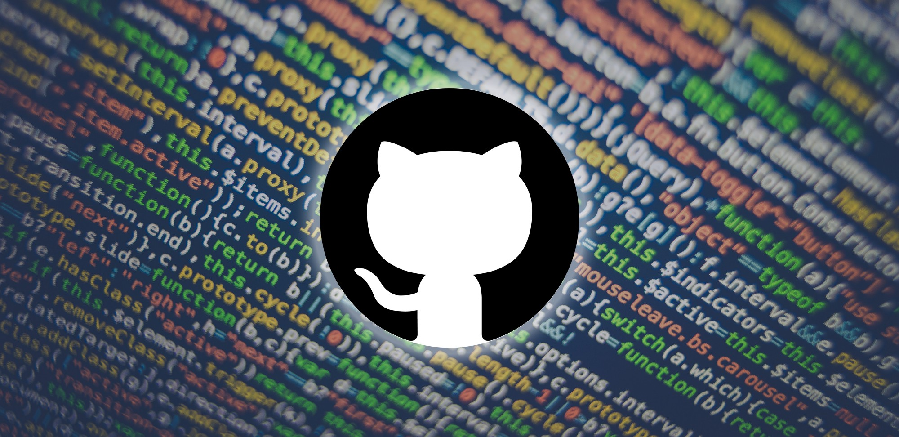
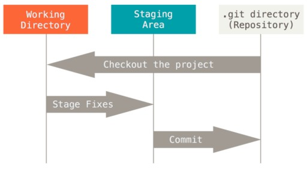
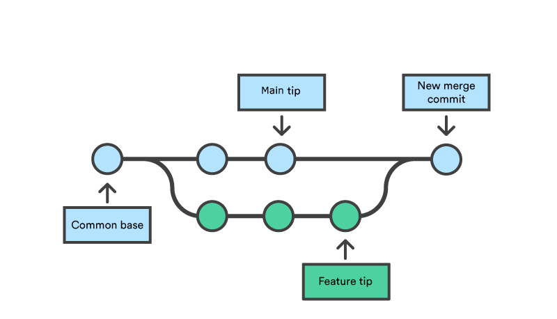
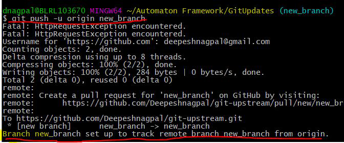
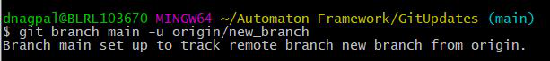
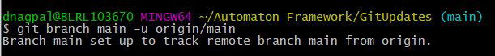
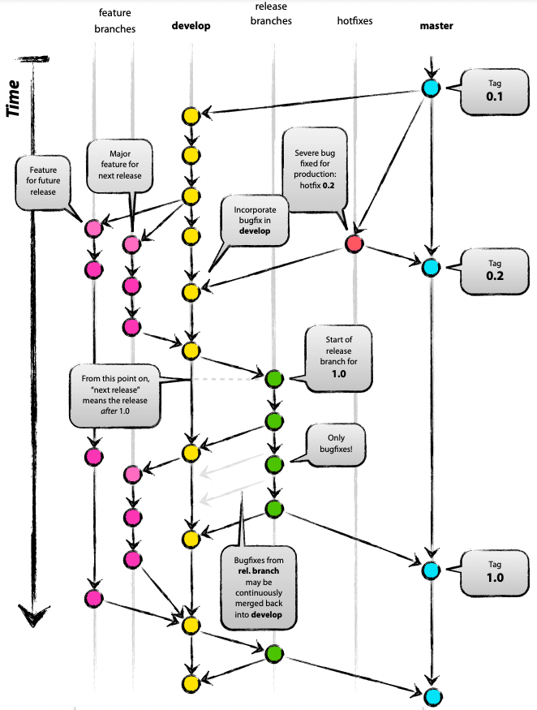

# self learning

## Feature

[`git rebase`](#1-rebase)

[`git checkout`](#4-checkout)

[`git commit`](#2-commit)

[`git merge`](#5-merge)

[`git merge --squash`](#6-merge---squash)

[`git reset`](#3-reset)

[Multiple upstream](#7-multiple-upstream)

[Merge conflicts](#8-merge-conflicts-and-resolution)

[Git's branch system](#9-gits-branch-system)



---

## **1. rebase**

Firstly, `rebase` is editing command.\
We'll use it when we want Git's history to look better than it was.

What happened behind the Scenes of `rebase`,
 we take all the commits in branch A that are not in branch B.
For each of these commits (starting with the first and in order):

- Consider the `diff` between it and the newest in B.\
- We will create a patch script from this calculation, and run this patch on the newest commit in B.\
- We will promote B and continue to the next commit.

### 1.1 Use cases

**1**. when we want to get a linear history (without seeing a graph in the log), even though in reality we created a Feature Branch and worked on it.

```bash
$git checkout master
$git merge fr1
$git branch -d fr1

$git rebase --onto master fr1 fr2
First, rewinding head to replay your work on top of it...
Applying: adding readme
Applying: add words file
```

**2**. when we want to give the impression that our Feature Branch only took a single commit, so that it will be easier to talk about the Pull Request we will create from it.

**3**. when we want to change the project history, for example delete commits or change messages of old commits.

```bash
git rebase -i master
```

Git opens a text editor ,we can choose which commits to take,to change the texts,to "compress" or delete from the history.

### 1.2 Advantages

- Fast
- Clean work

### 1.3 Disadvantages

Because Git doesn't automatically deal well with commits that have been overridden in the main repository (when other people have already based on their old versions), it is recommended not to rebase on commits that you have shared with others.\
If someone did rebase and upload the rewritten commits to the shared repository, you will have to run:

```bash
$git pull --rebase
```

### 1.4 alternative

`git merge`

---

## **2. commit**

The git commit command is one of the core primary functions of Git. Prior use of the git add command is required to select the changes that will be staged for the next commit. Then git commit is used to create a snapshot of the staged changes along a timeline of a Git projects history. Commitments are linked together as a single linked list. More precisely, there is a first commitment. When the second commit is created, it knows what comes after the first. And in this way information can be tracked.

A commit also has its own information, called meta data:

- The unique identifier of the commit, which can be used to find it
- The name of the author of the commit, who created it
- The date the commit was created
- A note describing what was done during the commit

    

After we added the file to the staging (git tracks it), we can add it to local repository (the final stage before uploading to an external server). commit is really a snapshot of the files on which we did the command.

### 2.1 Use cases

commit staged files to local repository by this command:

```bash
$git commit -m 'commit message'
```

The content to be committed can be specified in several ways:

- by using `git add` to incrementally "add" changes to the index before using the **commit** command (Note: even modified files must be "added");

- by using `git -rm` to remove files from the working tree and the index, again before using the **commit** command;

```bash
$edit hello.c 
$git rm goodbye.c 
$git add hello.c 
$git commit
```

- by listing files as arguments to the **commit** command (without --interactive or --patch switch), in which case the commit will ignore changes staged in the index, and instead record the current content of the listed files (which must already be known to Git);

```bash
$edit hello.c hello.h
$git add hello.c hello.h
$edit Makefile
$git commit Makefile
```

- by using the -a switch with the **commit** command to automatically "add" changes from all known files (i.e. all files that are already listed in the index) and to automatically "rm" files in the index that have been removed from the working tree, and then perform the actual commit;

```bash
$edit hello.c 
$git rm goodbye.c 
$git commit -a
```

- by using the --interactive or --patch switches with the **commit** command to decide one by one which files or hunks should be part of the commit in addition to contents in the index, before finalizing the operation.

### 2.2 Advantages

- let you pile up changes before showing them off.
- help manage the history of changes.

---

## **3. reset**

git reset is designed to undo local changes to the Staging Index and Working Directory.\
The reset command overwrites these three trees in a specific order, stopping when you tell it to:

- Move the branch HEAD points to (stop here if --soft).

- Make the index look like HEAD (stop here unless --hard).

### 3.1 Use cases

**1**. reset the file from the STAGING.\
After making `git add` to file (put it in the staging, ready-to-commit status), if you regret on it, using the git reset command to remove it from there.

```bash
$git reset FILENAME
```

**2**. Cancel a COMMIT that has already been performed.\
If we made a commit but regretted it and want to return it, this can also be done with `git reset`

```bash
$git reset --soft HEAD~
```

This command will take the commit (before we push it, of course) and all its changes and return them to the staging (the stage before the commit) from this point we can decide what to do with them.

**3**.destroy the last commit.\
Caution! It's something that will erase things. If you want to destroy the last commit, run this command:

```bash
$git reset --hard HEAD~
```

### 3.2 Advantages

make possible flexibility in Git Working

### 3.3. Disadvantages

may be dangerous!

### 3.4 alternative

- `git revert`
- `git checkout`

---

## **4. checkout**

`git-checkout` - Switch branches or restore working tree files.\
Checking out branches is similar to checking out old commits and files in that the working directory is updated to match the selected branch/revision; however, new changes are saved in the project history—that is, it’s not a read-only operation.

### 4.1 Use cases

- switch to a specified branch.

```bash
$git checkout < branch name >
```

- The `git checkout` command accepts a -b argument that acts as a convenience method which will create the new branch and immediately switch to it.

```bash
$git checkout -b < branch name >
```

By default git checkout -b will base the new-branch off the current HEAD. An optional additional branch parameter can be passed to git checkout. In this  example, ＜existing-branch＞ is passed which then bases new-branch off of existing-branch instead of the current HEAD.

```bash
$git checkout -b ＜new-branch＞ ＜existing-branch＞
```

-Work with remote repositories.  
In order to checkout a remote branch you have to first fetch the contents of the branch.

```bash
$git fetch --all
```

then checkout the remote branch like a local branch.

```bash
$git checkout ＜ remote branch ＞
```

Additionally you can checkout a new local branch and reset it to the remote branches last commit.

```bash
$git checkout -b ＜ branch name ＞
$git reset --hard origin/＜ branch name ＞
```

---

## Summary of `git checkout` and `git reset`


|          |HEAD | Index | Work directory | WD Safe? |
| -------- | ------- | -------- | ------- | ------- |
| Commit Level | | | | |
| reset --soft [commit]| REF | NO |NO  | YES |
| reset  [commit]| REF | YES |NO  | YES |
| reset --hard [commit]| REF | YES |YES  | **NO** |
| checkout < commit >| REF | YES |YES  | YES |
| File Level | | | | |
| reset [commit] < paths > | NO | YES |NO  | YES |
| checkout [commit] < paths > | NO | YES |YES  | **NO** |

---

## **5. merge**

Merging is Git's way of putting a forked history back together again. The git merge command lets you take the independent lines of development created by git branch and integrate them into a single branch.in one word- to combine.



### 5.1 Use cases

- merging the current branch into the receiving branch.

    ```bash
    $git merge < the name of the branch that will be merged >
    ```

- Fast forward merge
A fast-forward merge can occur when there is a linear path from the current branch tip to the target branch. Instead of “actually” merging the branches, all Git has to do to integrate the histories is move (i.e., “fast forward”) the current branch tip up to the target branch tip. This effectively combines the histories, since all of the commits reachable from the target branch are now available through the current one.\
The code below creates a new branch, adds two commits to it, then integrates it into the main line with a fast-forward merge.

    ```bash
    # Start a new feature
    $git checkout -b new-feature main
    # Edit some files
    $git add <file>
    $git commit -m "Start a feature"
    # Edit some files
    $git add <file>
    $git commit -m "Finish a feature"
    # Merge in the new-feature branch
    $git checkout main
    $git merge new-feature
    $git branch -d new-feature
    ```

### Example

- Merge branches fixes and enhancements on top of the current branch, making an octopus merge:

`git merge fixes enhancements`

- Merge branch obsolete into the current branch, using ours merge strategy:

`git merge -s ours obsolete`

- Merge branch maint into the current branch, but do not make a new commit automatically:

`git merge --no-commit maint`

This can be used when you want to include further changes to the merge, or want to write your own merge commit message.\
You should refrain from abusing this option to sneak substantial changes into a merge commit. Small fixups like bumping release/version name would be acceptable.

### 5.2 alternative

[git rebase]

---

## 6. merge --squash

Merging multiple commits onto another branch as a single commit.

### 6.1 Use case

 Taking all the code from the last commit in another branch and moves it to me in the working folder, without all the history of the branch. \
 On my side, if I'm satisfied with the result, I can run a commit after the merge and get a single commit of all the changes in the branch I'm merging.

```bash
$git checkout main
$git merge --squash dev
```

### 6.2 advantages

Squash merging keeps your default branch histories clean and easy to follow without demanding any workflow changes on your team.

### 6.3 disadvantages

Squash merging condenses the history of changes in your default branch, so it's important to work with your team to decide when you should squash merge or when you want to keep the full commit history of a topic branch.

---

## 7 .Multiple upstream

When you want to checkout a branch in git from a remote repository such as GitHub or Bitbucket, the “Upstream Branch” is the remote branch hosted on Github or Bitbucket. It’s the branch you fetch/pull from whenever you issue a plain git fetch/git pull basically without arguments.

### 7.1 Use cases

- Using the Git Push command with the “-u” option for the upstream branch.

```bash
$git push -u origin <branch name>
```

 Alternatively, you can use the ‘–set-upstream’ command as well to set the Upstream branch

```bash
$git push --set-upstream origin <branch name>
```



- Change Upstream Branches in Git.
Now, you need to track a new upstream branch than the one you just setup running:

```bash
$git branch -u <remote/branch name>
```

For example:

```bash
$git branch main -u <origin/new_branch>
$git branch main -u <origin/main>
```

The terminal prints out the confirmation message:





- you can list all your branches that are tracking upstream branches using “Git branch” with the -vv option:

```bash
$git branch -vv
```

## 8. Merge conflicts and resolution

Merge conflicts can be an intimidating experience. Luckily, Git offers powerful tools to help navigate and resolve conflicts. Git can handle most merges on its own with automatic merging features. A conflict arises when two separate branches have made edits to the same line in a file, or when a file has been deleted in one branch but edited in the other. Conflicts will most likely happen when working in a team environment.

There are many tools to help resolve merge conflicts. Git has plenty of command line tools like `git log`, `git reset`, `git status`, `git checkout`, `git reset` etc. In addition to the Git, many third-party tools offer streamlined merge conflict support features.
identify merge conflicts by `git status` and solve it.
there are tow ways to resolve merge conflicts:

- using the command line\
[resolve conflicts in command line]
- by GitHub\
 [how resole conflicts byGitHub]

 ---

## 9. [Git's branch system]

Branches are primarily used as a means for teams to develop features, giving them a separate workspace for their code.\
These branches are usually merged back to a master branch upon completion of work. \
In this way, features (and any bug and bug fixes) are kept apart from each other allowing you to fix mistakes more easily.\
This means that branches protect the mainline of code and any changes made to any given branch don’t affect other developers.

### 8.1 Use cases

having a branching strategy is necessary to avoid conflicts when merging and to allow for the easier integration of changes into the master trunk.

A branching strategy aims to:

- Enhance productivity by ensuring proper coordination among developers
- Enable parallel development
- Help organize a series of planned, structured releases
- Map a clear path when making changes to software through to production
- Maintain a bug-free code where developers can quickly fix issues and get these changes\
 back to production without disrupting the development workflow.

### An example for common Git branching strategies

- GitFlow:
    This branching strategy consists of the following branches:
  - Master
  - Develop
  - Feature- to develop new features that branches off the develop branch
  - Release- help prepare a new production release; usually branched from the develop branch and must be merged back to both develop and master
  - Hotfix- also helps prepare for a release but unlike release branches, hotfix branches arise from a bug that has been discovered and must be resolved; it enables developers to keep working on their own changes on the develop branch while the bug is being fixed.
    The main and develop branches are considered to be the main branches, with an infinite lifetime, while the rest are supporting branches that are meant to aid parallel development among developers, usually short-lived.



### Alternative

GitLab-Flow,Git-Flow and GitLab-Flow with release branch,\
GitHub-Flow and TBD,Trunk-Based Development (TBD)

[git rebase]:<https://www.simplilearn.com/git-rebase-vs-merge-article>

[resolve conflicts in command line]:https://docs.github.com/en/pull-requests/collaborating-with-pull-requests/addressing-merge-conflicts/resolving-a-merge-conflict-using-the-command-line

[how resole conflicts byGitHub]:https://docs.github.com/en/pull-requests/collaborating-with-pull-requests/addressing-merge-conflicts/resolving-a-merge-conflict-on-github

[Git's branch system]: https://www.abtasty.com/blog/git-branching-strategies/
